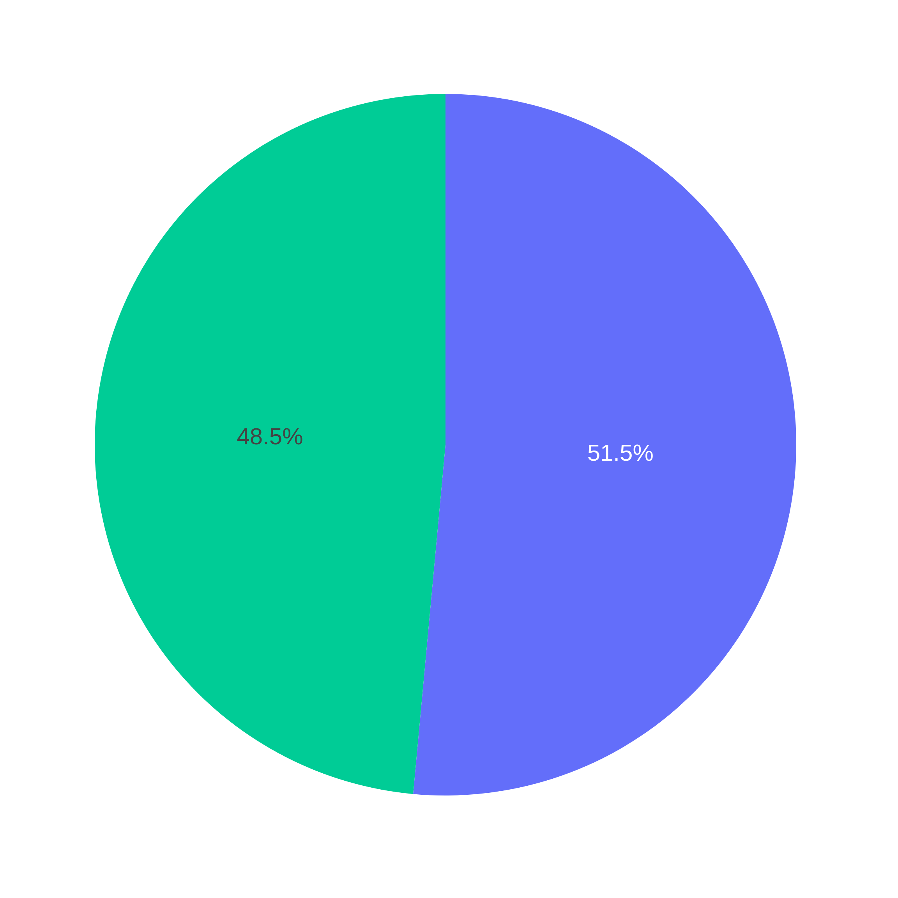
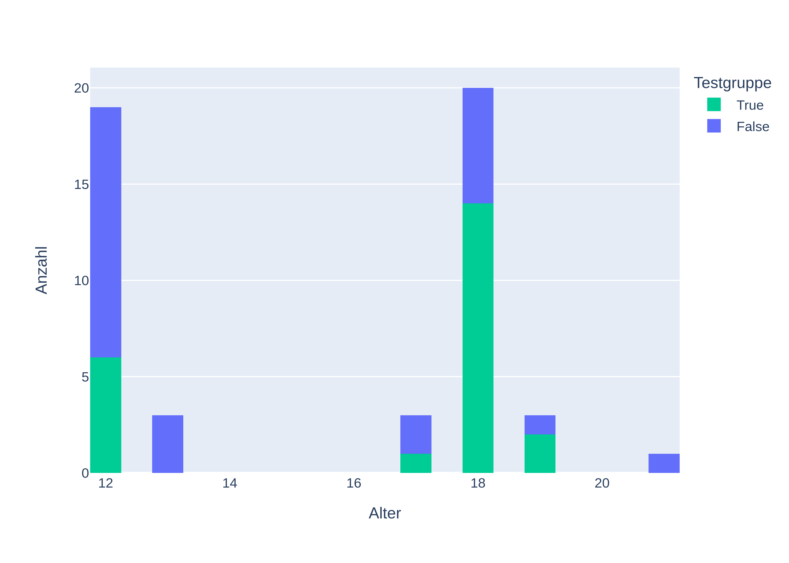
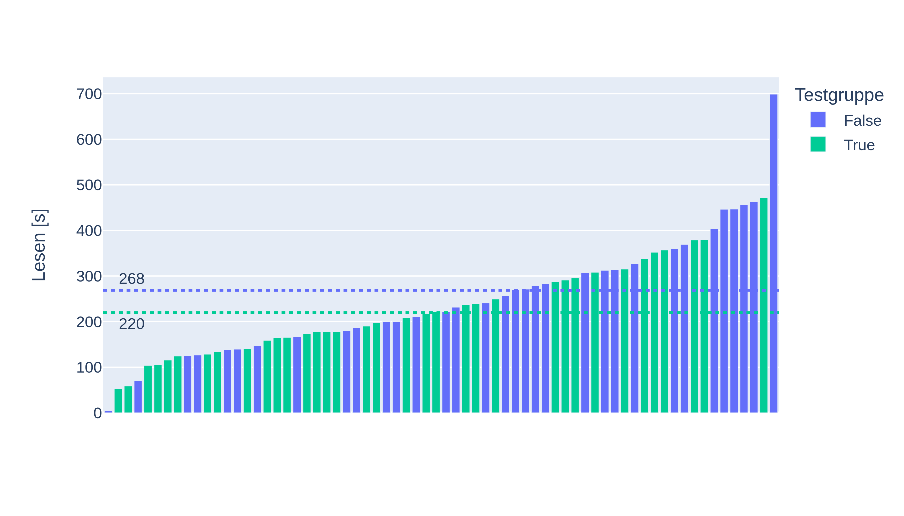
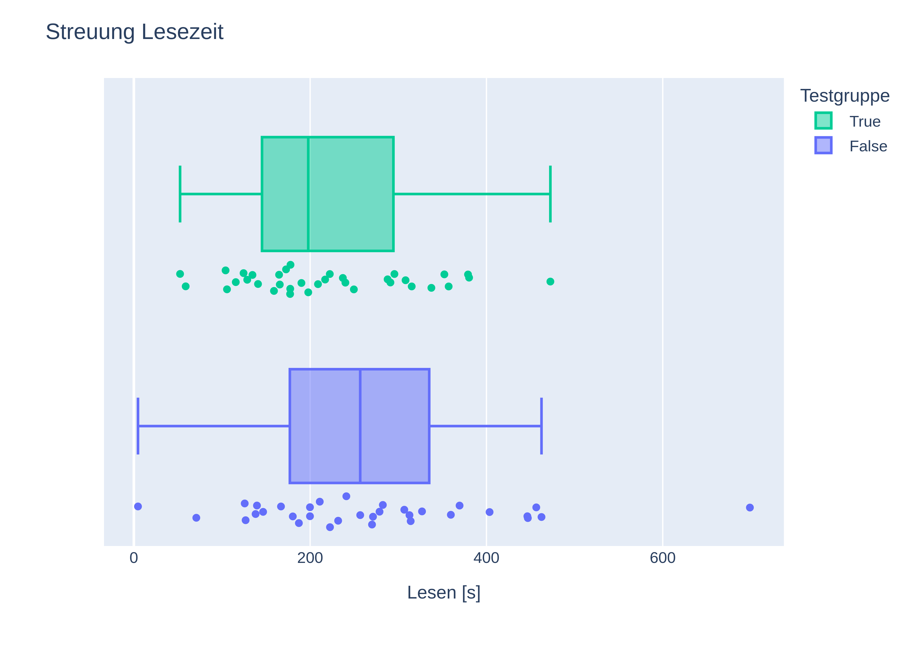
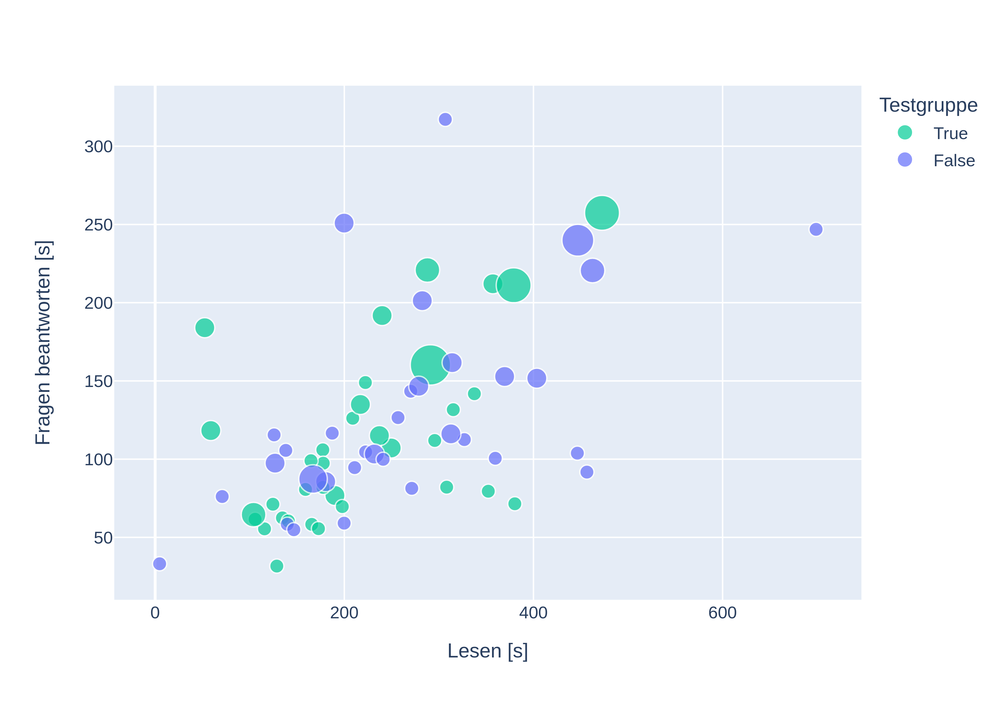
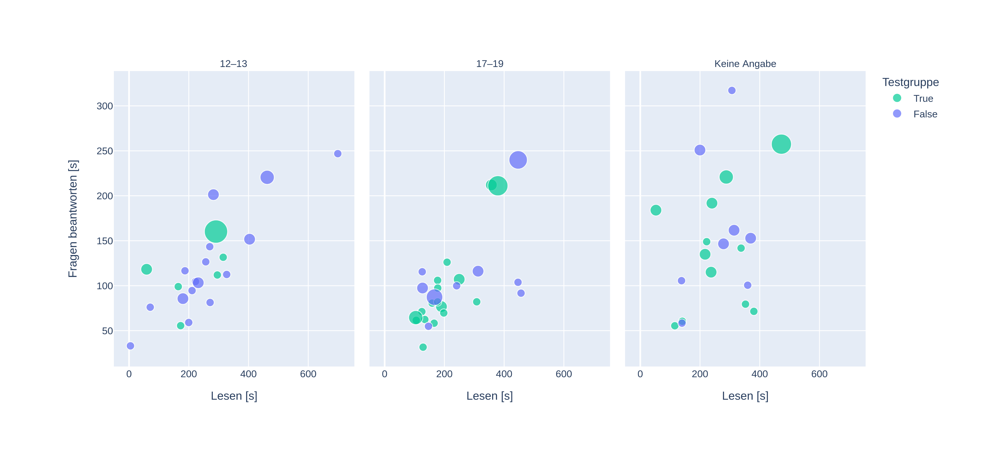
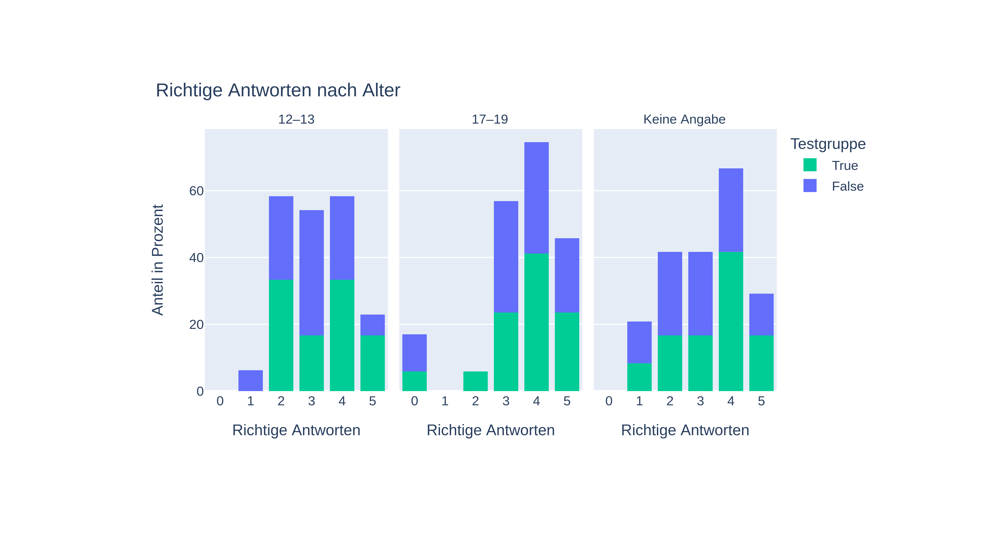
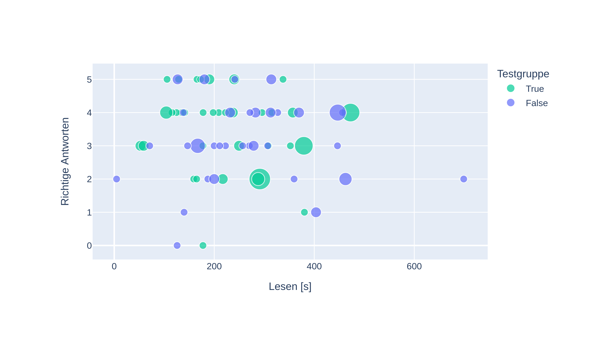
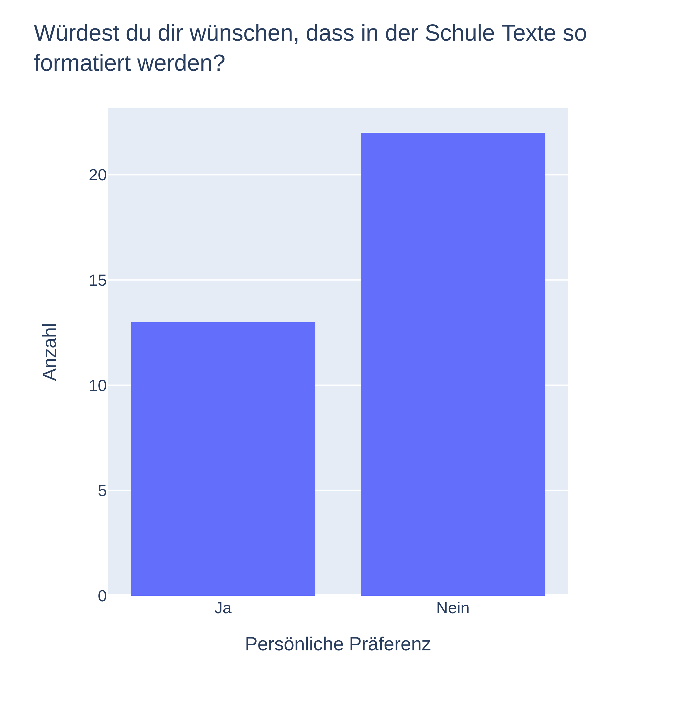

# Was ist Bionic Reading?

Bionic Reading ist eine Lesetechnik, die behauptet, das Denken zu beschleunigen, indem sie den Fokus auf bestimmte Fixierungspunkte im Text legt. Die Grundidee besteht darin, schneller zu denken als zu lesen, wodurch eine gesteigerte Lesegeschwindigkeit und ein verbessertes Textverständnis erreicht werden sollen. Es wird oft auf eine Studie hingewiesen, die diese Behauptungen stützen soll. Jedoch ist es wichtig anzumerken, dass die genannte Studie möglicherweise nicht eindeutig die versprochene Beschleunigung des Denkprozesses durch Bionic Reading bestätigt.

Im Rahmen dieser Lesetechnik werden Fixierungspunkte im Text identifiziert und hervorgehoben, was dazu dienen soll, das Gehirn bei der Informationsverarbeitung zu unterstützen. Die gezielte Hervorhebung und visuelle Strukturierung bestimmter Textabschnitte sollen dabei helfen, den Leser durch den Inhalt zu führen und so das Verständnis zu vertiefen.

# Studie

Für die Studie habe ich eine Online-Plattform entwickelt, bei der man erst einen Text bekommt und danach einen Fragebogen ausfüllt. Die Teilnehmer mussten Fragen zum Text und ein paar persönliche Fragen beantworten. Die Personen aus der Testgruppe hatten zusätzlich noch ein paar Fragen, wie es ihnen mit Bionic Reading ergangen ist.

Der Text ist die Hälfte des Leseverstehen-Textes aus dem Goethe-Zertifikat für Deutsch. Das ist das Äquivalent zum Cambridge-Zertifikat für Englisch. Ich habe das höchste Sprachniveau, C2, ausgewählt. Das sollte aber für Muttersprachler durchaus machbar sein. Die Fragen und der Text durften nur nicht zu einfach sein. Beim Testen mit verschiedenen Texten musste ich feststellen, dass man bei leichteren Texten die Fragen mit logischem Denken beantworten konnte, ohne den Text überhaupt gelesen zu haben. Deshalb hatte ich mich dann für den C2-Text aus dem [Übungsmaterial für das Zertifikat](https://bfu.goethe.de/c2_mod/lesen.php) entschieden, ihn gekürzt und nur die erste Hälfte verwendet.

## Teilnehmer

  
  

 

Alle Teilnehmer wurden in zwei Gruppen aufgeteilt. Es gibt die Test- und die Kontrollgruppe. Nur diejenigen, die in der Testgruppe waren, haben den speziell formatierten Text mit Bionic Reading bekommen.

Eigentlich teilt das System die Teilnehmer automatisch zu. Sie werden so verteilt, dass die Gruppen immer gleich groß sind. Das Problem ist, dass ich aus den über 80 Einträgen in der Datenbank nur knapp 70 benutzen konnte. Es gab Personen, die den Test nicht beendet haben oder welche, deren Ergebnisse ich aus anderen Gründen nicht verwenden konnte. Das ist ein Problem bei den jüngeren Schülern gewesen, weshalb die Testgruppe bei den 12- und 13-Jährigen nicht gleich groß sind. Das kann die Ergebnisse ein wenig verzerrt haben.

## Tracking

Ich habe den Teilnehmern etwas verschwiegen: Im Gegensatz zu Google Forms oder ähnlichen Tools kann ich nicht nur die Antworten auf die einzelnen Fragen auswerten, sondern auch das Verhalten der Teilnehmer analysieren. Im Hintergrund habe ich die Zeit getrackt, die unsere Kandidaten auf den einzelnen Seiten verbracht haben. Interessant war für mich die Lesedauer und die Zeit beim Beantworten der Fragen zum Text.

  
  

 

Man sieht in den Daten nicht direkt einen Trend, ob die Personen mit Bionic Reading aus der Testgruppe wirklich schneller waren. Dann müssten die Säulen auf der linken Seite überwiegend grün sein. Beim Beantworten der Fragen sieht man aber schon einen kleinen Trend in Richtung Bionic Reading. Im Durchschnitt liegt Bionic Reading etwas unter der Kontrollgruppe.

### Streuung

  
  

 

Hier kann man die Streuung im Datensatz besser erkennen. Es gibt vereinzelt Ausreißer. Die meisten Werte liegen jedoch im Bereich von 200 bis 300 Sekunden. Das war auch bei der Länge des Textes zu erwarten.

  

 

Interessant ist, wenn man die Lesezeit nach rechts und die Zeit zum Fragen beantworten nach oben darstellt. Die Größe der Punkte in diesem Diagramm stellt dar, wie oft der Teilnehmer zwischen Text und Fragen hin und her gewechselt ist.

Es ist ein Trend zu erkennen: Diejenigen, die den Text schnell lesen, beantworten auch die Fragen schnell. Man erkennt links mittig bei etwa 50 Sekunden zwei Personen, die den Text zwar schnell gelesen haben, aber recht lange zum Beantworten der Fragen gebraucht haben.

Eine Vermutung, die ich am Anfang aufgestellt hatte, war, dass die Teilnehmer mit Bionic Reading zwar schnell den Text lesen, aber öfter hin und her wechseln, da sie den Text schnell gelesen, jedoch nicht verstanden haben. Diese Vermutung lässt sich nicht bestätigen. Dann müssten die grünen Punkte in Bereich links unten alle größer sein. 

  

 

Hier ist das gleiche Diagramm noch einmal. Nur sind jetzt die Daten nach Altersgruppen geordnet. Da die Angabe freiwillig war, sollten man bei allen folgenden Diagrammen, in denen auch das Alter dargestellt wird, vorsichtig sein.

In der Lesedauer lassen sich zwischen den Siebtklässlern und den Oberstufenschülern nur leichte Unterschiede erkennen. Die Jüngeren brauchten insgesamt etwas mehr Zeit zum Lesen und auch mehr Zeit, um Fragen zu beantworten. Man erkennt zudem, dass es mehr Siebtklässler gab, die einfach aufgegeben oder gar nicht erst angefangen haben (links unten). Das liegt vermutlich daran, dass der Text recht schwer war.

### Selbsteinschätzung vs Realität

  

 

Bleiben wir bei der Geschwindigkeit. Hier ist die Lesedauer nach rechts und die Selbsteinschätzung zur Lesedauer nach oben dargestellt. Links unten wäre also schnell gelesen und selbst richtig eingeschätzt. Je weiter man also von dieser Diagonalen entfernt ist, desto schlechter hat man sich selbst einschätzen können. Jeder Mensch liest unterschiedlich schnell, aber der durchschnittliche Leser sollte in dem Bereich zwischen 200 und 300 Sekunden liegen.

Einige fühlen sich sogar schneller und waren deutlich langsamer als die Durchschnittswerte der Test- und Kontrollgruppe.

  

 

Das sind die Umfrageergebnisse aus der Testgruppe. Man erkennt, dass es keinen eindeutigen Trend gibt, ob Bionic Reading sich wenigstens schneller anfühlt, wenn es doch schon keine Auswirkungen auf die Lesedauer der Testgruppe hat.

  

 

Wenn man sich aber die gleiche Umfrage nach Altersgruppe sortiert anschaut, kann man einen deutlichen Unterschied erkennen: Für die jüngeren Teilnehmer hat sich Bionic Reading für fast 70 % schneller angefühlt. Wenn wir uns aber an die Ergebnisse der Lesedauer von vorhin erinnern, waren sie eigentlich gar nicht schneller als die Siebtklässler aus der Kontrollgruppe.

  

 

Es gab nicht nur die Frage, ob einem die Formatierung von Bionic Reading geholfen hat, schneller zu lesen, sondern auch die Frage, ob es einem *leichter* gefallen ist, den Text zu lesen. Es stellte sich heraus, dass die Personen, denen das Lesen leichter gefallen ist, nicht schneller oder langsamer waren als die anderen aus der Testgruppe.

  
  

 

Das sind die Ergebnisse für die Selbsteinschätzung zur Leichtigkeit. Ähnlich zu den Ergbnissen der letzten Umfrage, scheint Leichtigkeit keinen Einfluss auf die Lesegeschwindigkeit zu besitzen. Wie schon bei der Einschätzung zur Lesegeschwindigkeit, scheint Bionic Reading von persönlichen Präferenzen abhängig zu sein.

## Antworten

Kommen wir nun zu den Antworten auf die Fragen. Ich muss zugeben, die Fragen waren wirklich nicht leicht, aber nicht zu schwer. Wenn man den Text tatsächlich aufmerksam gelesen hat, kann man sie beantworten.

| Frage               | Richtig | Falsch |
| :------------------ | :-----: | :----: |
| Gefühle Beruf       |   58    |   11   |
| Warum Lehrer?       |   59    |   10   |
| Öffentliche Meinung |   26    |   43   |
| Vorwurf Eltern      |   42    |   27   |
| Internet            |   45    |   24   |

Bei fast allen Fragen sind mehr richtige als falsche Antworten. Nur bei der dritten Frage sind deutlich mehr falsche.

  

 

Die meisten Personen haben vier Antworten richtig. Man erkennt aber auch wieder einen Trend, dass es den Siebtklässlern schwerer fiel als den Oberstufenschülern.

  

 

Hier kann man ganz gut erkennen, dass wer länger liest, nicht unbedingt auch bessere Antworten hat. Beinahe genauso sieht es bei der Zeit, die man zum Beantworten der Fragen braucht, aus (nicht extra als Diagramm hier dargestellt).

  
  

 

Die letzte Kategorie ist das Textverständnis. Auch bei der Frage danach, ob Bionic Reading beim Textverständnis geholfen hat, gibt es keine großen Unterschiede in den Altersgruppen. Es ist fast 50-50 in "Hilft" und "Hilft nicht" aufgeteilt.

  

 

Man kann nur eine leichte Tendenz sehen, dass Teilnehmern, die Bionic Reading besser zum Verstehen des Textes fanden, auch die Fragen besser beantwortet haben.

# Was nun?

  
  

 

Bionic Reading verspricht mehr als es tatsächlich nützt. Versprechungen wie "Doppelt so schnell lesen" konnte ich nicht einmal annähernd in den Daten erkennen.

Es ist zum Schluss eine persönliche Präferenz, ob man Bionic Reading gut oder schlecht findet. Aber bei monatlich 2 € für die Grundvariante und 8 € für die Premiumvariante sollte jeder überlegen, ob er blind den Versprechungen von der Website glaubt.

---

<small>Bionic Reading® ist eine eingetragene Marke der Bionic Reading AG. Alle Rechte an der Marke liegen beim jeweiligen Inhaber.</small>
